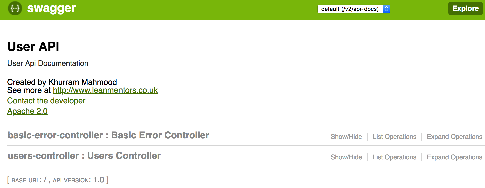
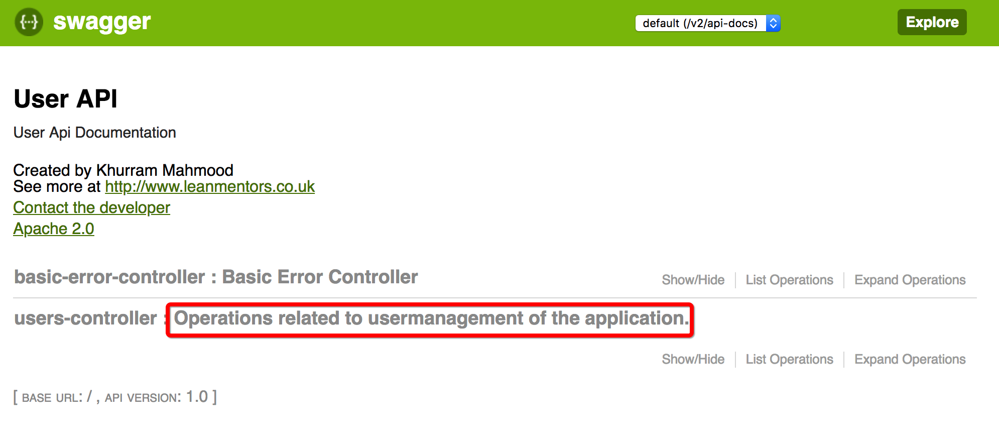
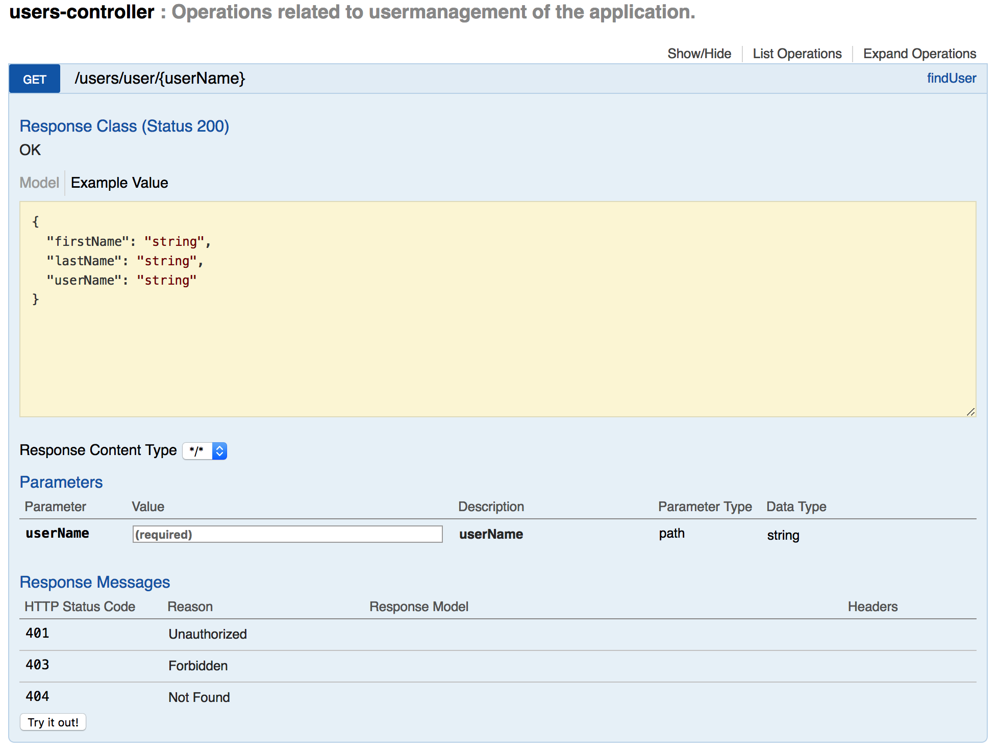
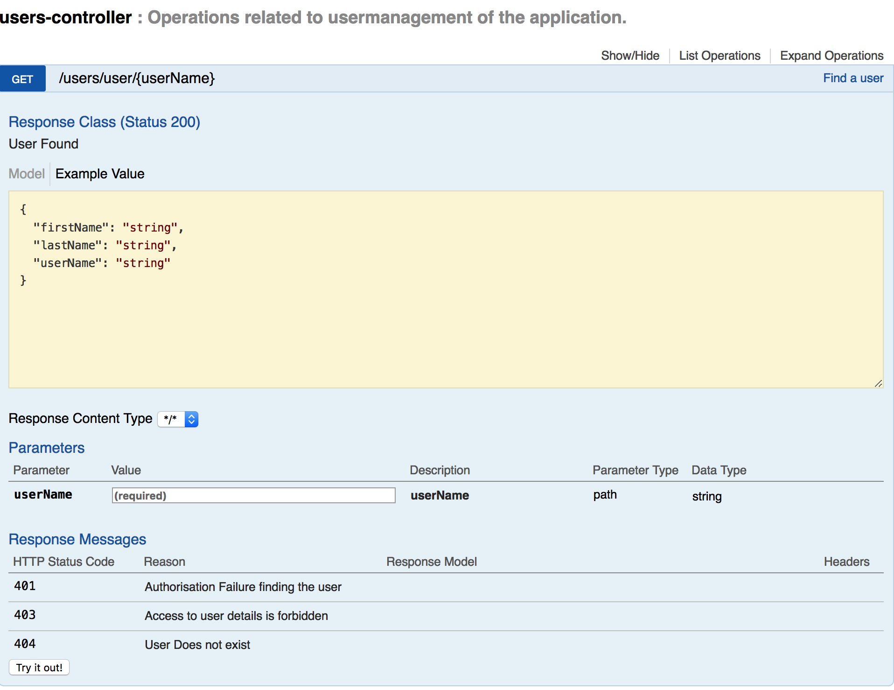
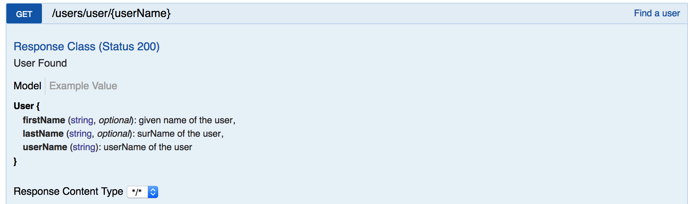

[](https://opensource.org/licenses/Apache-2.0)

# Documenting Service API using Swagger

This is sample project showing how to use swagger to generate API documentation

## Maven Depenencies 

Swagger needs two dependencies,  swagger and swagger ui.

```xml
		<dependency>
			<groupId>io.springfox</groupId>
			<artifactId>springfox-swagger2</artifactId>
			<version>2.7.0</version>
		</dependency>

		<dependency>
			<groupId>io.springfox</groupId>
			<artifactId>springfox-swagger-ui</artifactId>
			<version>2.7.0</version>
		</dependency>
```


## Swagger Config

You will need to enable swagger using `@EnableSwagger2` annotation.

Also need to create Docket bean, I have created this inside SwaggerConfig class as follows:

```java 
    public static final Contact DEFAULT_CONTACT = new Contact("Khurram Mahmood",
                                                                "http://www.leanmentors.co.uk",
                                                                "nouser@email.com");


    private static final ApiInfo DEFAULT_API_INFO = new ApiInfoBuilder().title("User API ")
                                                    .description("User Api Documentation")
                                                    .version("1.0").contact(DEFAULT_CONTACT)
                                                    .license("Apache 2.0")
                                                    .licenseUrl("https://my-license.com").
                                                    build();

    @Bean
    public Docket api() {
        return new Docket(DocumentationType.SWAGGER_2)
                .apiInfo(DEFAULT_API_INFO)
                .select()
                .apis(RequestHandlerSelectors.any())
                .paths(PathSelectors.any())
                .build();
    }
```

A Docket bean will define the API.

## Running the application 

```shell
mvn spring-boot:run 
```

Once application is running you can access the application using url


## Access API Docs

You can access API docs using below url

```
http://localhost:8080/v2/api-docs
```

However you can see that its json being displayed in the browser, which is hardly human readable. This is where swagger ui will come handy,  you can access the ui using following link:

```
[http://localhost:8080/swagger-ui.html#!/](http://localhost:8080/swagger-ui.html#!/)
```

This should look something like below where we can see all the operations available and their details with default values:



As you can see, this is a very basic information here. Generally we need bit more context in the API documentation. For this we will start with changing the controller and provide more details about the API.


## Customising the API Documentation
We can customise the controller with additional documentation about the purpose of API it exposed using `@API` on each controller level. For instance:

```java

    @RestController
    @RequestMapping("/users")
    @Api(value="usermanagement", description="Operations related to usermanagement of the application.")
    public class UsersController {
     // your code goes here
    }
```


With this we have added the description of the API exposed by the controller as shown by red rectangle

## Detailing the Operations

At the moment our API description for /user/{userName} looks something like this:

We can do this by using `@ApiOPeration` annotation. Where we can describe the a particular operation/end point of the controller.
We can also use `@ApiResponses` and `@ApiResponse` annotation to further add the details of the response codes.


```java

    @ApiOperation(value = "Find a  user")
    @ApiResponses(value = {
            @ApiResponse(code = 200, message = "User Found"),
            @ApiResponse(code = 401, message = "Authorisation Failure finding the user"),
            @ApiResponse(code = 403, message = "Access to user details is forbidden"),
            @ApiResponse(code = 404, message = "User Does not exist")
    }
    )
    @GetMapping("/user/{userName}")
    public User findUser(@PathVariable(name = "userName") String userName) {
        // your code goes here
    }
```


This would changed and explain the operation and error reasons and your documentation would look something like this:


You can see that, we have explained error codes in the cases. This would help the users of the API understand better rather than relying on defaults.

## Details of API Model

So far we have been able to explain the API operations, however what
input an output of those operations are what each field of those objects
mean is not shown in the documentation. To achieve that we can use
`@ApiModel` and `@ApiModelProperty` annotations as below:

```java


import io.swagger.annotations.ApiModel;
import io.swagger.annotations.ApiModelProperty;
import lombok.AllArgsConstructor;
import lombok.Data;

@Data
@AllArgsConstructor
@ApiModel
public class User {

    @ApiModelProperty(notes = "userName of the user", required = true)
    private String userName;

    @ApiModelProperty(notes ="given name of the user")
    private String firstName;

    @ApiModelProperty(notes = "surName of the user")
    private String lastName;
}


```
Above will show documentation of API model and show following details about our model.




## Summary

In a nutshell it is very easy to document your apis and it takes minimal effort to write api documentations. If we take good care and discipline our API users will easily understand the API.